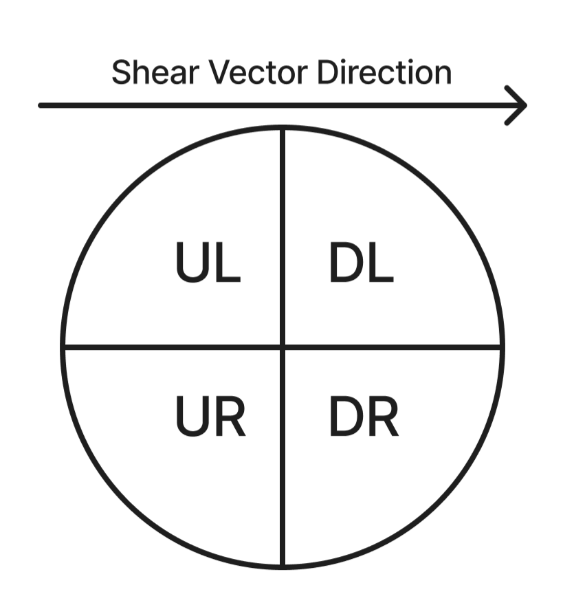

# Lightning-Analysis
UW MSDS Capstone Project with NorthWest Research Associates (NWRA)

## Table of Contents
* [Objective](#objective)
* [Background Information](#background)
* [Directory Overview](#directory-overview)
* [Key Deliverables](#deliverables)
* [Dependencies and Setting Up the Repository](#dependencies)
  * [Environment](#environment)
  * [Data](#data)
* [Future Work](#future-work)
* [Acknowledgements](#acknowledgements)

| Team Member  | GitHub                                   |
|------------------|--------------------------------------|
| April Gao       | [aprilggg](https://github.com/aprilggg)|
| Elaine Zhang     | [ezhang17](https://github.com/ezhang17)|
| Janice Kim      | [ymkim814](https://github.com/ymkim814)|

<a id="objective"></a>

## Objective
- Identify WWLLN lightning bursts for inner core and rainband lightning
- Investigate the relationship between WWLLN lightning bursts and tropical cyclone intensification stages

<a id="background"></a>

## Background Information
Tropical cyclones (TCs) are among the most powerful and destructive weather systems on Earth, posing significant threats to life, property, and infrastructure. We aim to explore the relationship between lightning bursts in tropical cyclones and tropical cyclone intensification stages using World Wide Lightning Location Network (WWLLN) data and tropical cyclone wind speed and pressure measurements.

### Provided Data

NWRA provided [WWLLN](https://wwlln.net/) lightning and storm track data for TCs across 6 basins from 2010 to 2020, with 984 total TCs in the dataset. For this project, we only include TCs of category 1 or higher in our evaluation of lightning bursts, leaving us with 479 TCs for the lightning burst evaluation and subsequent intensification statistical analysis.

For each TC in our dataset, we have:
- World Wide Lightning Location Network (WWLLN) Data: (.txt)
    - Lightning strokes with timestamp and distance from storm center
    - Includes 472 Category 1 or higher TCs across 6 basins from 2010 to 2020
- Storm Track File: (.txt)
    - Storm center coordinates, wind speed, pressure with timestamps taken at regular intervals throughout the storm
- Vertical Wind Shear Vector Data: (.mat)
    - Shear vector angle and magnitude for WWLLN lightning strokes
    - Vector angle determines the shear quadrant, used with rainband lightning due to storm behavior differences depending on quadrant

### Definitions

#### Inner Core and Rainband
We define the inner core as within 100km of storm center, and rainband as between 200km and 400km of storm center.

#### Intensification Stage

We use the following table to categorize intensification stages based off forward-looking 24-hour changes in wind speed (knots). For example, a storm would be categorized as Weakening if its wind speed is 20 knots lower tomorrow at the same time than it is today. Because of this definition, there will not be an intensification stage for the last 24 hours of a tropical cyclone.

**Intensification Stage Bins**
| Intensification Stage | Change in Winds (Knots) in 24 Hours (Jiang and Ramirez, 2013)|
| --------------------- | ----------------------|
| Rapidly Weakening | <-30 |
| Weakening | -30 to -10 |
| Neutral | -10 to 10 |
| Intensifying | 10 to 30 |
| Rapidly Intensifying | >30 |

#### Category

We use the [Saffir-Simpson Hurricane Wind Scale](https://www.nhc.noaa.gov/aboutsshws.php) to classify category. We categorize storms in two ways: as a whole and by individual time periods. The overall storm category is based on the TC's maximum wind speed, while the current category reflects the wind speed at a specific time period. For example, a TC with a maximum wind speed of 85 knots is classified as Category 2. However, during periods when its wind speed is lower, let's say 65 knots, the current category for that time is Category 1.

**TC Category Bins - Saffir-Simpson Hurricane Wind Scale**
| TC Category | Sustained Winds (Knots) |
|  ---------- | ------------|
| 1 | 64-82 kt |
| 2 | 83-95 kt |
| 3 | 96-112 kt |
| 4 | 113-136 kt |
| 5 | 137 kt or higher |

#### Shear Quadrant
Vertical wind shear is the change in wind speed or direction with altitude, represented by a vector showing the difference between wind vectors at different heights. We use the vertical wind shear angle to determine the shear quadrant, used with rainband lightning due to storm behavior differences depending on the shear quadrant. For this project, we only apply shear quadrant classification to rainband lightning.

We calculate shear quadrant for rainband lightning using the following formulas.

We use the formula to get the shear angle:
```
shearAngleCG = geoAngleCG - shearAngle
```
We calculate geoAngleCG (geographic angle of lightning relative to North, where lightning due East of the storm center would give an angle of 90 degrees) using arctan and the distance east/north of the storm center. shearAngle is included in the provided data files.

We then assign the lightning stroke to a shear quadrant using shearAngleCG: (note that the shear vector in the diagram is going towards the right, while the shear angle is calculated relative to North)
- 0-90 - Downshear Left (DL)
- 90-180 - Downshear Right (DR)
- 180-270 - Upshear Right (UR)
- 270 -360 - Upshear Left (UL)



<a id="directory-overview"></a>

## Directory Overview

**analysis_data** - contains data files used in the Power BI dashboard and intensification analysis created from the lightning burst identification code

**data_pipeline** - contains notebooks used to upload, clean, process, filter, and create data files used in the lightning burst identification and exploratory analysis portions of this project, this directory deals with the raw data files

**exploratory_analysis** - contains notebooks as well as visualizations created in the exploratory analysis portion of this project

**intensification_analysis** - contains notebooks and visualizations for the statistical analysis of the relationship between lightning bursts and TC intensification change

**lightning_burst_identification** - contains notebooks, datasets, and visualizations created in the statistical identification of inner core and rainband lightning bursts at both the individual TC and basin levels, also contains the Power BI dashboard created in this part of the project

Intermediate files that are too large to upload to GitHub can be found here, along with the individual TC visualizations created in the lightning burst identification stage of the project: [Google Drive](https://drive.google.com/drive/folders/1VxhljPNirGQL2jP3-bbhCS94neifmepc?usp=sharing)

### Directory Structure
```
.
├── analysis_data
|   └── README.md
|   └── innercore_lightning_data.csv
|   └── innercore_bursts.csv
|   └── innercore_threshold_summary.csv
|   └── rainband_lightning_data.csv
|   └── rainband_bursts.csv
|   └── rainband_threshold_summary.csv
├── data_pipeline
|   └── data
|       └── innercore_timebin_joined.csv
|       └── rainband_shear_timebin_joined.csv
|   └── intermediate_data
|       └── ...
|   └── README.md
|   └── data_file_cleaning.ipynb
|   └── data_processing.ipynb
|   └── data_upload.ipynb
|   └── rainband_data.ipynb
├── exploratory_analysis
|   └── README.md
|   └── basin_descriptive_analysis.ipynb
|   └── exploratory_analysis.ipynb
├── intensification_analysis
|   └── README.md
|   └── innercore_burst_w_intensification.ipynb
|   └── rainband_burst_w_intensification.ipynb
├── lightning_burst_identification
|   └── data
|       └── ...
|   └── images
|       └── ...
|   └── visualizations
|       └── ...
|   └── README.md
|   └── __init__.py
|   └── dashboard_documentation.md
|   └── lightning_burst_dashboard.pbix
|   └── lightning_threshold_functions.py
|   └── lightning_threshold_innercore.ipynb
|   └── lightning_threshold_rainband.ipynb
|   └── vis_upload.ipynb
├── LICENSE
├── README.md
├── requirement.yml
├── requirement_simplified.yml
└── shear_quadrant_graphic.png
```

Detailed documentation on code requirements and file outputs can be found in each folder's README file. Details on the truncated directories in the above directory structure can also be found in each main folder's README file.

<a id="deliverables"></a>

## Key Deliverables
In this section we will briefly introduce the key deliverables of the project.

### Data Pipeline
- Combined WWLLN lightning counts and storm track data to use in calculating lightning burst thresholds
    - Inner core 30-minute binned lightning counts joined to nearest wind and pressure measurements
    - Rainband 30-minute binned lightning counts joined to nearest wind and pressure measurements, split by shear quadrant

### Lightning Burst Identification
- Lightning burst identification Jupyter Notebooks
    - Inner core individual TC burst threshold calculations and evaluations, basin-level burst threshold calculations and evaluations
    - Rainband individual TC burst threshold calculations and evaluations
- Lightning burst identification Power BI dashboard
    - Flexible visualization tool displaying plots for both inner core and rainband lightning burst detection activities
- Lightning burst identification visualizations
    - Individual `.png` files of lightning burst detection visualizations for each TC
    - Includes both inner core and rainband lightning types

### Intensification Statistical Analysis
- Intensification statistical analysis Jupyter Notebooks
    - Inner core lightning burst and storm intensification statistical analysis at the overall, basin, current category, and category group levels
    - Rainband lightning burst and storm intensification statistical analysis at the overall, basin, current category, and category group levels

### Written Report
- Written report detailing the project components and deliverables, as well as methods and intermediate steps taken to create the key deliverables


<a id="dependencies"></a>

## Dependencies and Setting Up the Repository

This repository can be cloned to local following these [instructions](https://docs.github.com/en/repositories/creating-and-managing-repositories/cloning-a-repository).

<a id="environment"></a>

### Environment
This repository consists mostly of Jupyter Notebook files. We include [requirement.yml](requirement.yml) and [requirement_simplified.yml](requirement_simplified.yml) files for user convenience.

The code in this repository requires the following installations:
- Python [Official Python Installation Documentation](https://www.python.org/downloads/)

We recommend using [conda](https://docs.conda.io/projects/conda/en/latest/index.html) to set up the environment using the provided `.yml` files in the repository. - [Official Documentation](https://docs.conda.io/projects/conda/en/latest/user-guide/tasks/manage-environments.html#creating-an-environment-from-an-environment-yml-file)

**A Simple Guide to Setting Up an Environment With Conda:**
1. Make sure you have the following:
    - [requirement.yml](requirement.yml) or [requirement_simplified.yml](requirement_simplified.yml)
    - [Miniconda or Anaconda installation](https://docs.conda.io/projects/conda/en/latest/user-guide/getting-started.html)
2. Create the environment from the [requirement.yml](requirement.yml) file - run the following in your terminal:
```
conda env create -f requirement.yml
```
Use either `requirement.yml` or `requirement_simplified.yml` in this code depending on your preferences.
3. Activate the new environment in your terminal:
```
conda activate nwra_capstone
```
4. Verify that the new environment was installed correctly - look for `nwra_capstone`:
```
conda env list
```
5. Activate the new environment
```
conda activate nwra_capstone
```

<a id="data"></a>

### Data
This project uses the following data sources, initially provided on a USB:
- World Wide Lightning Location Network (WWLLN) Data: (.txt)
    - file name ends with `WWLLN_Locations.txt`
- Storm Track File: (.txt)
    - file name ends with `Trackfile.txt`
- Vertical Wind Shear Vector Data: (.mat)
    - file name ends with `Intensity_Shear.mat`

The data pipeline assumes that the raw data is contained in a folder structure like the one below, where each TC's data is contained in a separate file:
```
.
├── year
|   └── basin
|       └── storm number
|           └── trackfile
|           └── WWLLN data
|           └── shear file
```
example:
```
.
├── 10
|   └── ATL
|       └── 1
|           └── ATL_10_1_Trackfile.txt
|           └── ATL_10_1_WWLLN_Locations.txt
|           └── ATL_10_1_Intensity_Shear.mat
```

All other intermediate and analysis data files created and used in this project are included in either:
- `data_pipeline/`
    - `data/` - data used in `lightning_burst_identification`
    - `intermediate_data/`* - data used in `data_pipeline/` to create the `data/` files
- `lightning_burst_identification/data/` - basin-level threshold data for inner core lightning only
- `analysis_data/` - data used in the Power BI dashboard and `intensification_analysis/`

*files too large to include on GitHub can be found here: [Google Drive](https://drive.google.com/drive/folders/1VxhljPNirGQL2jP3-bbhCS94neifmepc?usp=sharing)

<a id="future-work"></a>

## Future Work
Due to time constraints, we note the following as future work to continue building on the analysis presented in this repository:
- Lightning burst identification accuracy improvements:
    - Removing landfall from lightning burst analysis - remove data points where TC storm center is within 100km of land since landfall is associated with higher lightning activity regardless of storm intensification stage
- Expansion of basin-level lightning burst threshold calculations:
    - Currently, only the inner core has basin-level thresholds, this activity can be applied to the rainband data as well, and can also be performed at the shear quadrant granularity
- Lightning burst dashboard improvements:
    - Alternatives to using Python visualizations in Power BI due to limitations (users need Python installed, cannot publish to Power BI web, etc.)
    - Prevent burst markers from overlapping when there are multiple markers on one lightning bin for readability
- Inclusion of GLM data:
    - WWLLN data tends to include more intense lightning strokes due to the nature of the data collection methods. Using GLM data to perform the same analysis may yield more insightful results.
- Machine learning in lightning burst detection:
    - The use of machine learning to detect lightning bursts may show unexpected patterns, and can be a more flexible method of identifying lightning bursts than the ones used in this project.

<a id="acknowledgements"></a>

## Acknowledgements
WWLLN Data Acknowledgment - The authors are using data from the World Wide Lightning Location Network, a collaborative consortium of over 70 worldwide collaborators, managed at the University of Washington.

Thank you to our sponsors, Dr. Jeremy Thomas and Dr. Natalia Solorzano at NWRA, for making this project happen.

Special thanks to our UW MSDS capstone coordinator, Dr. Megan Hazen, for organizing the capstone projects and guiding us for the past two quarters.