# Lightning Burst Dashboard User & Development Guide

This document provides usage and development guides for the `lightning_burst_dashboard.pbix` Power BI dashboard included in this directory. This dashboard includes visualizations created in `lightning_threshold_innercore.ipynb` and `lightning_threshold_rainband.ipynb` and includes both inner core and rainband data.

* [Dependencies and Set Up](#dependencies)
* [User Guide](#user)
    * [Overview](#overview)
    * [Inner Core Visualizations](#inner-core)
    * [Rainband Visualizations](#rainband)
* [Developer Guide](#dev)
    * [Data Model](#data)
    * [Dashboard Components](#components)
        * [Python Visualizations](#python)
* [Future Work and Improvements](#future)

## Dependencies and Set Up

** check if necessary for all or just development??

This dashboard requires [Power BI Desktop](https://learn.microsoft.com/en-us/power-bi/fundamentals/desktop-get-the-desktop) and the following files from the [analysis_data](../analysis_data/) directory:
- `innercore_bursts.csv`
- `innercore_lightning_data.csv`
- `rainband_bursts.csv`
- `rainband_lightning_data.csv`

These files are created in the `lightning_threshold_innercore.ipynb` and `lightning_threshold_rainband.ipynb` notebooks in this folder.

The Python visualizations in this dashboard require installation of Python and the following non-native Python libraries:
- pandas
- matplotlib

Refer to the [Power BI Python visualization documentation](https://learn.microsoft.com/en-us/power-bi/connect-data/desktop-python-visuals) for more details.

After installing Power BI Desktop, open the `lightning_burst_dashboard.pbix` file.

You will first see a pop-up asking if you wish to enable scripts - click Enable.

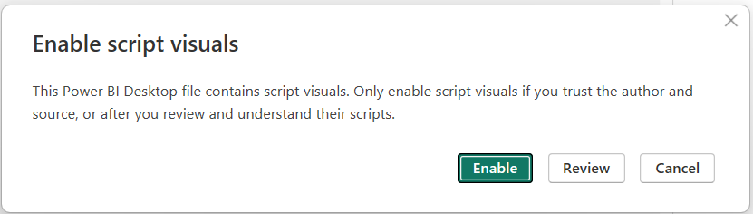

## User Guide

In this section, we go over how to use and interpret the visualizations included in the dashboard.

### Overview

The dashboard opens to this view with tabs at the bottom. Each tab contains a different set of visualizations and can be filtered using the slicer on the right-hand side. Slicers are synced between the inner core tabs and the rainband tabs.

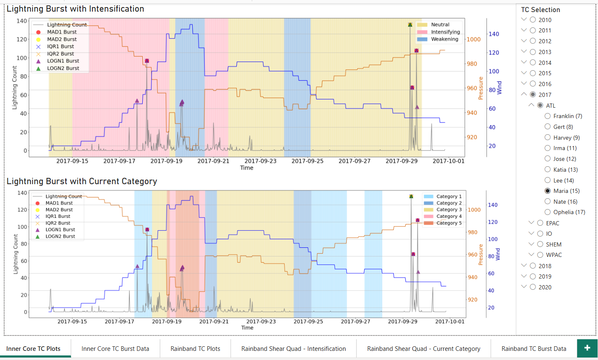

#### Tabs
The dashboard includes 6 tabs:
- Inner Core TC Plots
- Inner Core TC Burst Data
- Rainband TC Plots
- Rainband Shear Quad - Intensification
- Rainband Shear Quad - Current Category
- Rainband TC Burst Data

#### Filtering the Dashboard

Each tab includes a slicer to filter the data. Choose a specific TC by selecting the year, basin, and then the TC name. The number in parentheses next to the name denotes the TC's number. Visualizations are set up to only display one TC at a time.

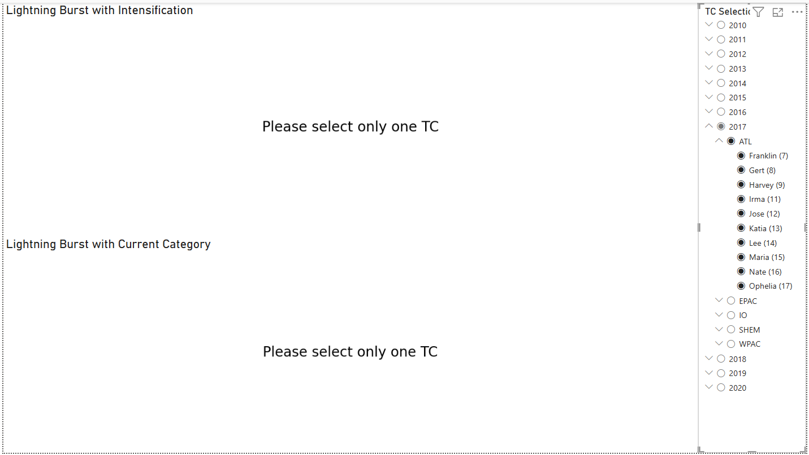

If more than one TC is selected accidentally on the graph views, the visualizations will display "Please select only one TC". This prevents the dashboard from attempting to graph more than one TC at a time, which may lead to the dashboard crashing due to the sheer amount of data loading at once.

#### Viewing Visualizations Individually
Each visualization can be shown individually by clicking on "Focus mode" in the menu at the upper right corner or lower right corner of the graph when hovering or clicking on the graph.

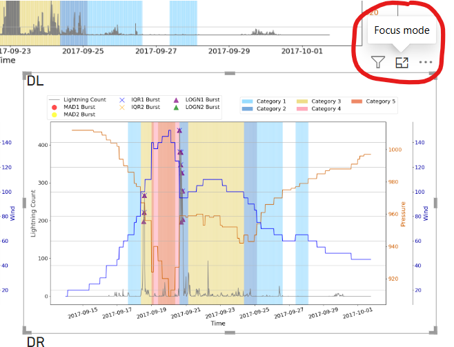

Clicking on "Focus mode" will show the chosen visualization on its own page. Select "Back to report" to return to the previous view.

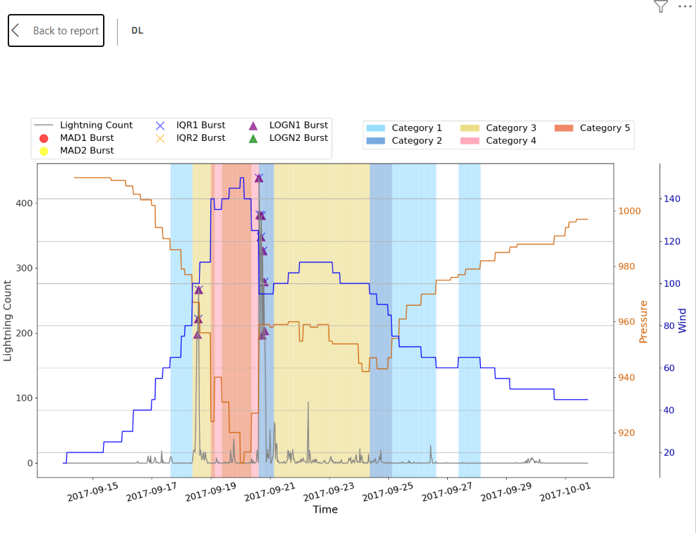

### Inner Core Visualizations

The following tabs display inner core lightning data:
- Inner Core TC Plots
- Inner Core TC Burst Data

#### Inner Core TC Plots

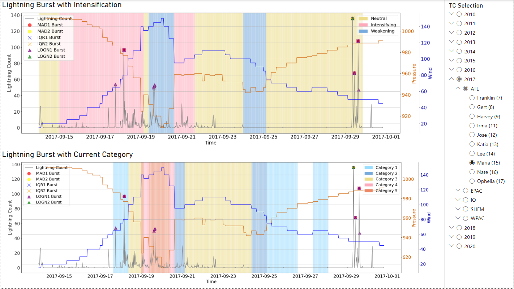

This tab displays inner core lightning detected bursts on intensification stage color-coded backgrounds on the top and current category color-coded backgrounds on the bottom. Each graph shows the lightning counts in gray, pressure in orange, and wind speed (knots) in blue for the whole duration of the selected TC (regardless of if the data was included in lightning burst threshold calculation). Each of the 6 burst identification methods is displayed with a differently colored marker.

For the intensification stage plot, we only display the 3-category intensification stages - Neutral, Intensifying, and Weakening. Rapidly Weakening and Rapidly Intensifying are combined with Weakening and Intensifying, respectively. The white background denotes the last 24 hours of the storm where we cannot calculate intensification stage using forward-looking 24-hour wind speed differences.

For the current category plot, we color the background using the Saffir-Simpson scale. The white background denotes wind speeds less than 64 knots.

#### Inner Core TC Burst Data

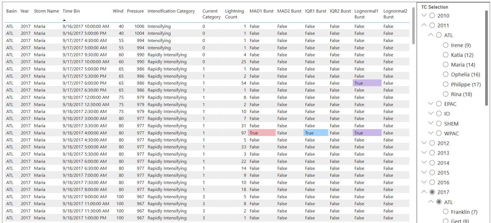

This tab displays inner core lightning detected bursts at the time bin level in a tabular format. Detected bursts are colored by their corresponding marker color used in the time series plot. Note that this view does not include data not used in the threshold calculation - excludes lightning associated with wind speeds less than 40 knots and time bins with no lightning strokes.Use this view to get a better view into overlapping detected bursts by different methods (e.g. the 9/18/2017 4AM time bin shows 3 methods detected this time bin as a burst, shown by the red, blue, and purple highlighted cells).

### Rainband Visualizations

The following tabs display rainband lightning data:
- Rainband TC Plots
- Rainband Shear Quad - Intensification
- Rainband Shear Quad - Current Category
- Rainband TC Burst Data

#### Rainband TC Plots

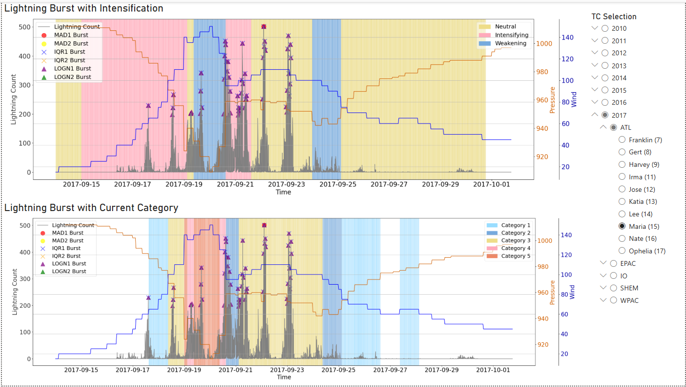

This tab displays rainband lightning detected bursts on intensification stage color-coded backgrounds on the top and current category color-coded backgrounds on the bottom. Each graph shows the lightning counts in gray, pressure in orange, and wind speed (knots) in blue for the whole duration of the selected TC (regardless of if the data was included in lightning burst threshold calculation). Each of the 6 burst identification methods is displayed with a differently colored marker.

For the intensification stage plot, we only display the 3-category intensification stages - Neutral, Intensifying, and Weakening. Rapidly Weakening and Rapidly Intensifying are combined with Weakening and Intensifying, respectively. The white background denotes the last 24 hours of the storm where we cannot calculate intensification stage using forward-looking 24-hour wind speed differences.

For the current category plot, we color the background using the Saffir-Simpson scale. The white background denotes wind speeds less than 64 knots.

#### Rainband Shear Quad - Intensification

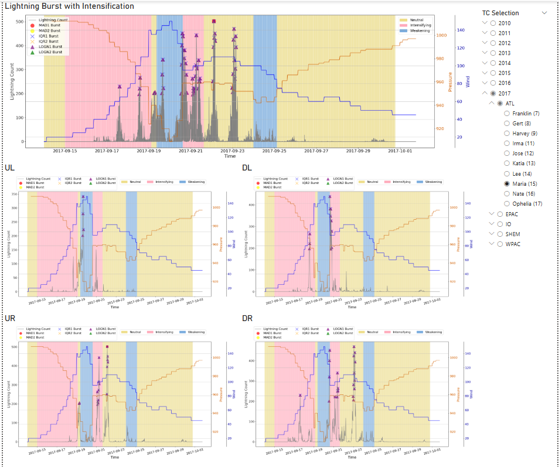

This view shows the intensification stage color-coded graph from the Rainband TC Plots tab at the top, and splits the data into each shear quadrant at the bottom for a 2x2 view. The bottom 4 graphs each display lightning counts, detected bursts, and associated wind/pressure data for each one of the 4 shear quadrants over time. The 2x2 view can be used to explore the distribution of detected bursts across the different shear quadrants.

#### Rainband Shear Quad - Current Category

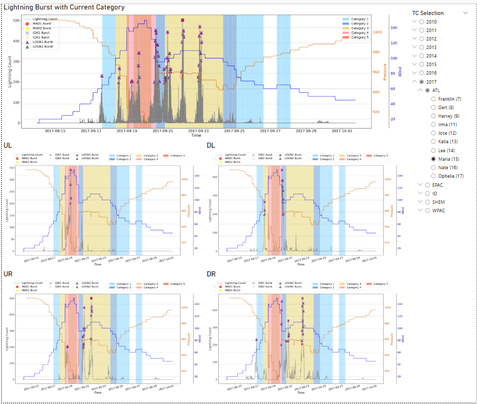

This view shows the current category color-coded graph from the Rainband TC Plots tab at the top, and splits the data into each shear quadrant at the bottom for a 2x2 view. The bottom 4 graphs each display lightning counts, detected bursts, and associated wind/pressure data for each one of the 4 shear quadrants over time. The 2x2 view can be used to explore the distribution of detected bursts across the different shear quadrants.

#### Rainband TC Burst Data

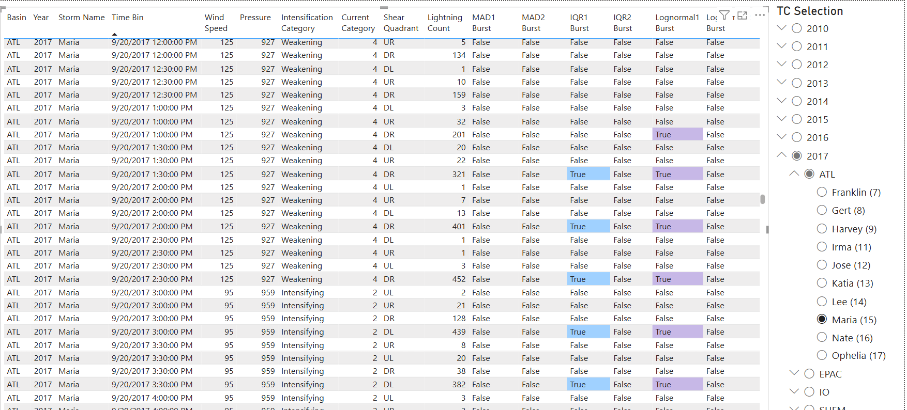

This tab displays rainband lightning detected bursts at the time bin level in a tabular format. Detected bursts are colored by their corresponding marker color used in the time series plot. Each time bin will have up to 4 rows, one for each shear quadrant. Note that this view does not include data not used in the threshold calculation - excludes lightning associated with wind speeds less than 40 knots and time bins with no lightning strokes. Use this view to get a better view into overlapping detected bursts by different methods (e.g. the 9/20/2017 3PM time bin includes one row per shear quadrant (UL, UR, DR, DL) and shows that the IQR1 and LOGN1 methods both detected a burst for the DL shear quadrant).

## Development Guide

### Data Model

### Dashboard Components

### Python Visualizations

## Future Work and Improvements