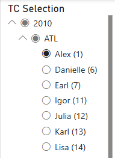
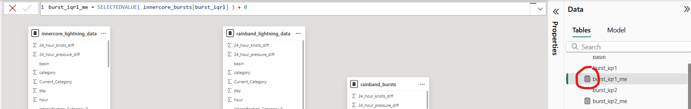

# Lightning Burst Dashboard User & Development Guide

This document provides usage and development guides for the [`lightning_burst_dashboard.pbix`](lightning_burst_dashboard.pbix) Power BI dashboard included in this directory. This dashboard includes visualizations created in `lightning_threshold_innercore.ipynb` and `lightning_threshold_rainband.ipynb` and includes both inner core and rainband data.

* [Dependencies and Set Up](#dependencies)
* [User Guide](#user)
    * [Overview](#overview)
    * [Inner Core Visualizations](#inner-core)
        * [Inner Core TC Plots](#innercore-plots)
        * [Inner Core TC Burst Data](#innercore-burst)
    * [Rainband Visualizations](#rainband)
        * [Rainband TC Plots](#rainband-plots)
        * [Rainband Shear Quad - Intensification](#shear-i)
        * [Rainband Shear Quad - Current Catgory](#shear-cc)
        * [Rainband TC Burst Data](#rainband-burst)
* [Developer Guide](#dev)
    * [Data Setup](#data)
        * [Data Sources](#data-sources)
        * [Data Transformations](#transformations)
        * [Data Model - Custom Columns](#custom-columns)
        * [Data Model - Relationships](#relationships)
    * [Dashboard Components](#components)
        * [Python Visualizations](#python)
        * [Tables](#tables)
        * [Slicers](#slicers)
* [Future Work and Improvements](#future)

Official Power BI documentation can be found [here](https://learn.microsoft.com/en-us/power-bi/).

<a id="dependencies"></a>

## Dependencies and Set Up

This dashboard requires [Power BI Desktop](https://learn.microsoft.com/en-us/power-bi/fundamentals/desktop-get-the-desktop). Users are not required to have the source data files on their local machine if the data does not need to be refreshed.

The [Python visualizations](https://learn.microsoft.com/en-us/power-bi/connect-data/desktop-python-visuals) in this dashboard require [installation of Python](https://www.python.org/downloads/) and the following non-native Python libraries:
- pandas
- matplotlib

Install the above libraries by opening the terminal or command prompt and running the following:
```
pip install pandas matplotlib
```

Refer to the [Power BI Python scripts documentation](https://learn.microsoft.com/en-us/power-bi/connect-data/desktop-python-scripts) for more details on Python script requirements in Power BI.

After installing Power BI Desktop and setting up the Python requirements, open the `lightning_burst_dashboard.pbix` file.

You will first see a pop-up asking if you wish to enable scripts - click Enable.


<a id="user"></a>

## User Guide

In this section, we go over how to use and interpret the visualizations included in the dashboard.

<a id="overview"></a>

### Overview

The dashboard opens to this view with tabs at the bottom. Each tab contains a different set of visualizations and can be filtered using the slicer on the right-hand side. Slicers are synced between the inner core tabs and the rainband tabs.

The Power BI "Visualizations" and "Data" panels to the right of the dashboard can be collapsed to enhance the user experience.


#### Tabs
The dashboard includes 6 tabs:
- Inner Core TC Plots
- Inner Core TC Burst Data
- Rainband TC Plots
- Rainband Shear Quad - Intensification
- Rainband Shear Quad - Current Category
- Rainband TC Burst Data

Select a tab by clicking on the tab at the bottom of the dashboard. Some tabs may be hidden depending on monitor - use the arrows at the bottom left side of the tab ribbon to navigate and view any hidden tabs.

Each tab's view can be adjusted by clicking on "Page view" in the View tab at the top. Users can choose from Fit to page, Fit to width, or Actual size. Users can also manually zoom in and out on each tab to adjust the view to personal preference.


#### Filtering the Dashboard


Each tab includes a slicer to filter the data. Choose a specific TC by selecting the year, basin, and then the TC name. The number in parentheses next to the name denotes the TC's number. Visualizations are set up to only display one TC at a time.


If more than one TC is selected accidentally on the graph views, the visualizations will display "Please select only one TC". This prevents the dashboard from attempting to graph more than one TC at a time, which may lead to the dashboard crashing due to the sheer amount of data loading at once.

#### Viewing Visualizations Individually
Each visualization can be shown individually by clicking on "Focus mode" in the menu at the upper right corner or lower right corner of the graph when hovering or clicking on the graph.


Clicking on "Focus mode" will show the chosen visualization on its own page. Select "Back to report" to return to the previous view.


<a id="inner-core"></a>

### Inner Core Visualizations

The following tabs display inner core lightning data:
- Inner Core TC Plots
- Inner Core TC Burst Data

<a id="innercore-plots"></a>

#### Inner Core TC Plots


This tab displays inner core lightning detected bursts on intensification stage color-coded backgrounds on the top and current category color-coded backgrounds on the bottom. Each graph shows the lightning counts in gray, pressure in orange, and wind speed (knots) in blue for the whole duration of the selected TC (regardless of if the data was included in lightning burst threshold calculation). Each of the 6 burst identification methods is displayed with a differently colored marker.

For the intensification stage plot, we only display the 3-category intensification stages - Neutral, Intensifying, and Weakening. Rapidly Weakening and Rapidly Intensifying are combined with Weakening and Intensifying, respectively. The white background denotes the last 24 hours of the storm where we cannot calculate intensification stage using forward-looking 24-hour wind speed differences.

For the current category plot, we color the background using the Saffir-Simpson scale. The white background denotes wind speeds less than 64 knots.

<a id="innercore-burst"></a>

#### Inner Core TC Burst Data


This tab displays inner core lightning detected bursts at the time bin level in a tabular format. Detected bursts are colored by their corresponding marker color used in the time series plot. Note that this view does not include data not used in the threshold calculation - excludes lightning associated with wind speeds less than 40 knots and time bins with no lightning strokes.Use this view to get a better view into overlapping detected bursts by different methods (e.g. the 9/18/2017 4AM time bin shows 3 methods detected this time bin as a burst, shown by the red, blue, and purple highlighted cells).


<a id="rainband"></a>

### Rainband Visualizations

The following tabs display rainband lightning data:
- Rainband TC Plots
- Rainband Shear Quad - Intensification
- Rainband Shear Quad - Current Category
- Rainband TC Burst Data

<a id="rainband-plots"></a>

#### Rainband TC Plots


This tab displays rainband lightning detected bursts on intensification stage color-coded backgrounds on the top and current category color-coded backgrounds on the bottom. Each graph shows the lightning counts in gray, pressure in orange, and wind speed (knots) in blue for the whole duration of the selected TC (regardless of if the data was included in lightning burst threshold calculation). Each of the 6 burst identification methods is displayed with a differently colored marker.

For the intensification stage plot, we only display the 3-category intensification stages - Neutral, Intensifying, and Weakening. Rapidly Weakening and Rapidly Intensifying are combined with Weakening and Intensifying, respectively. The white background denotes the last 24 hours of the storm where we cannot calculate intensification stage using forward-looking 24-hour wind speed differences.

For the current category plot, we color the background using the Saffir-Simpson scale. The white background denotes wind speeds less than 64 knots.

<a id="shear-i"></a>

#### Rainband Shear Quad - Intensification


This view shows the intensification stage color-coded graph from the Rainband TC Plots tab at the top, and splits the data into each shear quadrant at the bottom for a 2x2 view. The bottom 4 graphs each display lightning counts, detected bursts, and associated wind/pressure data for each one of the 4 shear quadrants over time. The 2x2 view can be used to explore the distribution of detected bursts across the different shear quadrants.

<a id="shear-cc"></a>

#### Rainband Shear Quad - Current Category


This view shows the current category color-coded graph from the Rainband TC Plots tab at the top, and splits the data into each shear quadrant at the bottom for a 2x2 view. The bottom 4 graphs each display lightning counts, detected bursts, and associated wind/pressure data for each one of the 4 shear quadrants over time. The 2x2 view can be used to explore the distribution of detected bursts across the different shear quadrants.

<a id="rainband-burst"></a>

#### Rainband TC Burst Data


This tab displays rainband lightning detected bursts at the time bin level in a tabular format. Detected bursts are colored by their corresponding marker color used in the time series plot. Each time bin will have up to 4 rows, one for each shear quadrant. Note that this view does not include data not used in the threshold calculation - excludes lightning associated with wind speeds less than 40 knots and time bins with no lightning strokes. Use this view to get a better view into overlapping detected bursts by different methods (e.g. the 9/20/2017 3PM time bin includes one row per shear quadrant (UL, UR, DR, DL) and shows that the IQR1 and LOGN1 methods both detected a burst for the DL shear quadrant).

<a id="dev"></a>

## Developer Guide

This section goes over the data model setup, dashboard components, and an explanation of the Python visualizations in this dashboard. This section is geared towards developers and includes a section on improvements and expansions for future use.

<a id="data"></a>

### Data Setup

<a id="data-sources"></a>

#### Data Sources
The dashboard uses the following files from the [analysis_data](../analysis_data/) directory:
- `innercore_bursts.csv`
- `innercore_lightning_data.csv`
- `rainband_bursts.csv`
- `rainband_lightning_data.csv`

These files are created in the `lightning_threshold_innercore.ipynb` and `lightning_threshold_rainband.ipynb` notebooks in this folder.

To transform the data and update data source paths, click the drop-down arrow next to the table with pencil icon at the top banner on the report view of the dashboard.


Select "Data source settings" to check current file paths and update the data file paths - this is necessary if the source data changes and for viewing the data transformations applied to the source files.


To add more data sources, refer to this [official documentation](https://learn.microsoft.com/en-us/power-bi/connect-data/desktop-connect-to-data).

<a id="transformations"></a>

#### Data Transformations
Transformations are applied to each of the files to faciliate the relationships between tables explained in the next section. We need to create a column with unique values to use as a primary key for the relationships, so we concatenate storm codes with time bins (+ shear quadrants for rainband).

Select "Transform data" to see the transformation steps for each data source.


When clicking on each step on the right (in the Applied Steps menu), the upper box will show the [Power Query M code](https://learn.microsoft.com/en-us/powerquery-m/) used to apply the transformations.


Transformations applied (Applied Steps menu on the right) to each inner core data file using the Transform data page:
1. Source - import source data
2. Promoted Headers - read the first line of the file as headers
3. Changed Type - cast each column as its respective type (e.g. time_bin as datetime)
4. Duplicated Column - created a copy of the time_bin column
5. Changed Type - changed the type of the time_bin copy column to text instead of datetime
6. Added Custom - added a custom column concatenating the storm code with time bin
7. Renamed Columns - rename the previous added column to "storm_code_time_bin"
8. Removed Columns - remove the duplicated time bin column

Transformations applied to the rainband files:
1. Source - import source data
2. Promoted Headers - read the first line of the file as headers
3. Changed Type - cast each column as its respective type (e.g. time_bin as datetime)
4. Duplicated Column - created a copy of the time_bin column
5. Changed Type - changed the type of the time_bin copy column to text instead of datetime
6. Custom1 - added a custom column concatenating the storm code with time bin
7. Renamed Columns - rename the previous added column to "storm_code_time_bin"
8. Custom2 - added a custom column concatenating the storm name with storm_code_time_bin
9. Renamed Columns1 - rename the previous added column to "storm_code_time_bin_name"
10. Custom3 - added a custom column concatenating the storm_code_time_bin_name with shear quadrant
11. Renamed Column2 - rename the previous added column to "storm_code_time_bin_shear"
12. Removed Columns - remove the duplicated time bin column

<a id="custom-columns"></a>

#### Data Model - Custom Columns

Navigate to the Data Model view using the menu on the left bar.


Here, we see the 4 data tables and the relationships in a diagram format. The tab on the right side shows each table, and can be expanded to view each column along with its data type for the table.


The calculator icon denotes that the column is an added custom measure column. The top bar will display the custom measure's code. This code is in [DAX](https://learn.microsoft.com/en-us/dax/) syntax.



Similarly, the icons with a table in the back and either fx or a sigma also denotes a custom column. The top bar will display the custom column's code. This code is in [DAX](https://learn.microsoft.com/en-us/dax/) syntax.


An easy way to check if the column is a custom column added in this menu or not is by clicking on the column name in the right-hand menu. If the top bar is grayed out or missing, the column is from the source data (or added in the transformations stage). If the top bar has code, the column is a custom column added using [DAX](https://learn.microsoft.com/en-us/dax/) syntax.


A blank/grayed out top bar.


DAX code for the storm_display_name column.

**innercore_bursts custom columns:**
- burst_iqr1_me - used to color-code IQR1 burst detection cells in the Inner Core TC Burst Data tab
- burst_iqr2_me - used to color-code IQR2 burst detection cells in the Inner Core TC Burst Data tab
- burst_logn1_me - used to color-code LOGN1 burst detection cells in the Inner Core TC Burst Data tab
- burst_logn2_me - used to color-code LOGN2 burst detection cells in the Inner Core TC Burst Data tab
- burst_mad1_me - used to color-code MAD1 burst detection cells in the Inner Core TC Burst Data tab
- burst_mad2_me - used to color-code MAD2 burst detection cells in the Inner Core TC Burst Data tab
- storm_code_name - concatenates storm code with storm name

**innercore_lightning_data custom columns:**
- storm_code_name - concatenates storm code with storm name
- storm_display_name - formats the storm name by adding the storm number to the end in parentheses, parses out the storm number from the storm code
- storm_year - parses out the storm year from the storm code instead of using the year in the data (some storms include data for two years but are only attributed to one)

**rainband_bursts custom columns:**
- burst_iqr1_measure - used to color-code IQR1 burst detection cells in the Inner Core TC Burst Data tab
- burst_iqr2_measure - used to color-code IQR2 burst detection cells in the Inner Core TC Burst Data tab
- burst_logn1_measure - used to color-code LOGN1 burst detection cells in the Inner Core TC Burst Data tab
- burst_logn2_measure - used to color-code LOGN2 burst detection cells in the Inner Core TC Burst Data tab
- burst_mad1_measure - used to color-code MAD1 burst detection cells in the Inner Core TC Burst Data tab
- burst_mad2_measure - used to color-code MAD2 burst detection cells in the Inner Core TC Burst Data tab
- storm_code_name - concatenates storm code with storm name

**rainband_lightning_data custom columns:**
- storm_code_name - concatenates storm code with storm name
- storm_display_name - formats the storm name by adding the storm number to the end in parentheses, parses out the storm number from the storm code
- storm_year - parses out the storm year from the storm code instead of using the year in the data (some storms include data for two years but are only attributed to one)

<a id="relationships"></a>

#### Data Model - Relationships

To view the relationships in the data model, click the relationships icon on the top banner of the Home tab.


This will open the relationships view, where relationships can be added or edited.


We set up 2 relationships for this data model, one for the inner core data and one for the rainband data. These relationships ensure that the datasets are synced and properly displayed by preventing duplicates.

We set up a [1-to-1](https://www.geeksforgeeks.org/relationships-in-sql-one-to-one-one-to-many-many-to-many/) relationship for both the inner core and rainband datasets. To view or edit the relationships, either click the three dots at the right side of the relationship or select the check box at the left and click "Edit" at the top.


The Edit page will allow you to select the tables to form a relationship between, and select the column to use as the key between the two tables. We use the storm_code_time_bin column for the inner core tables, and the storm_code_time_bin_shear column for the rainband tables. Note that a 1-to-1 relationship requires that both columns contain unique values. Ensure that the "Make this relationship active" box is checked at the bottom to apply the relationship to the data.


For more information on data table relationships, refer to this [official documentation](https://learn.microsoft.com/en-us/power-bi/transform-model/desktop-create-and-manage-relationships).


<a id="components"></a>

### Dashboard Components

This dashboard is composed of the following 3 types of visualizations:
- Python Visualization
- Table
- Slicer

<a id="python"></a>

#### Python Visualizations
Used in:
- Inner Core TC Plots
- Rainband TC Plots
- Rainband Shear Quad - Intensification
- Rainband Shear Quad - Current Category

The graphs in the dashboard are created using [Python visualizations](https://learn.microsoft.com/en-us/power-bi/connect-data/desktop-python-visuals) using Power BI's built-in Python visual option. Note that Power BI does not support Python visualizations in the web distribution (only supported in Power BI Desktop).

To edit a Python visualization, click on the visualization. Notice the gray bar at the bottom - the ^ button expands the script editor, while the play button at the very right will run the code for the visualization.


Click the ^ button to view the Python code.


A simple rundown of the code: In Power BI Python visualizations, "dataset" refers to the data being passed in to the visualization. We start by importing necessary libraries (pandas, matplotlib), and then creating a check for if the dataset includes only one TC. If the dataset contains more than 1 TC, we show "Please select only one TC" to prevent overloading the visualization with excessive amounts of data that will lead to Power BI crashing. After perfoming this check, we proceed to plot the lightning counts, wind speed, pressure, detected bursts, and color-code the background. This code is similar to the functions in [`lightning_threshold_functions.py`](lightning_threshold_functions.py).

The Python visualization requires that the columns used in the code are included in the "Values" section of the Visualizations panel on the right. We can include columns from multiple tables because we have the relationship set up in the data model. The Data panel will show a green check mark by the tables that this visualization uses. Both the Visualizations and Data panels can be expanded and collapsed using the >> button at the top of the right-hand panel.


Visualization titles and title formatting can be edited in the "Title" section of the "Format visual" part of the Visualizations panel.


**Columns Used In Python Visualizations:**
- lightning_count (lightning_data)
- knots (lightning_data)
- pressure (lightning_data)
- time_bin (lightning_data)
- Current_Category (lightning_data)
- Intensification_Category_3 (lightning_data)
- storm_code (lightning_data)
- storm_name (lightning_data)
- burst_iqr1 (bursts)
- burst_iqr2 (bursts)
- burst_logn1 (bursts)
- burst_logn2 (bursts)
- burst_mad1 (bursts)
- burst_mad2 (bursts)
- shear_quad (lightning_data, rainband shear quadrant visualizations only)

<a id="tables"></a>

#### Tables
Used in:
- Inner Core TC Burst Data
- Rainband TC Burst Data


The tables in this dashboard use the bursts tables and incorporates color-coding for the burst detection cells. Columns to display in the table need to be included in the "Columns" section of the Visualizations tab on the right side. The Data panel will show a green check mark by the tables that the table uses. By default, each column added to the table will be named the same way as the column name in the data table. Right click or click the drop-down button on the column in the Columns panel to rename the column in the table - select "Rename for this visual".

**Cell Color-coding:**

The MAD1 Burst, MAD2 Burst, IQR1 Burst, IQR2 Burst, Lognormal1 Burst, Lognormal2 Burst columns use color-coding of the cells to denote if a burst is detected. To set up or edit the color-coding, first navigate to the Format visual tab of the Visualizations panel.


Expand the "Cell elements" part of the panel and select the column of interest from the "Series" dropdown. Toggle the background color to On and open the Conditional formatting menu by clicking on the "fx" button.


The conditional formatting menu allows for coloring the cell by specific rules. We use the burst_method_me/burst_method_measure custom measures here, where the value of the measure will determine the color of the cell. We set the rule to be if the measure value is 1, we color the cell. The measure is encoded in a way that a False value = 0, and a True value = 1. We retain the colors from the graphs for the 6 threshold methods.

The official Power BI documentation for conditional formatting can be found [here](https://learn.microsoft.com/en-us/power-bi/create-reports/desktop-conditional-table-formatting).

**Columns Used In Tables (all from bursts tables):**
- basin
- year
- storm_name
- time_bin
- knots
- pressure
- Intensification_Category_5
- Current_Category
- lightning_count
- burst_mad1
- burst_mad2
- burst_iqr1
- burst_iqr2
- burst_logn1
- burst_logn2
- shear_quad (rainband only)

<a id="slicers"></a>

#### Slicers
Slicers are used in every tab of the dashboard. Slicers are synced across the inner core tabs and rainband tabs separately. The order of the columns in the "Field" section of the Visualizations panel determines the displayed hierarchy on the slicer.


Slicers are set up to be single-select, but may allow for a single-selection of a parent column that results in multiple selected child TCs (e.g. it is possible to single-select a basin for a year but end up selecting all the TCs in that basin/year). The visualizations are set up in a way that prevents the dashboard from crashing if this happens, and users can just select the specific storm again.


Toggle the single-select option in the "Format visual" tab of the Visualization panel. The Slicer's name can also be changed here in the "Slicer header" section.

Slicer sync settings can be edited by clicking the "Sync slicers" option at the top in the View ribbon. If a slicer is not already selected on the visualization, select one to edit.


This will open the Sync slicers menu, where you can select which pages this slicer is synced with. Currently, the inner core tabs are synced separately from the rainband tabs.


**Columns Used In Slicers (all from lightning_data tables):**
- storm_year
- basin
- storm_display_name

<a id="future"></a>

## Future Work and Improvements

Some improvements, future work, and considerations for this dashboard include:
- Creating the Python visualizations using other visualization types
    - Due to the limitations on Python visualizations in Power BI as well as the requirements for running Python visualizations, changing the visualizations to use other more widely-supported visualization types will make the dashboard more accessible
- Burst marker overlap in the graphs
    - Burst markers overlap and make it hard to see all the burst detection methods at once
    - The current alternative is using the table to supplement the graph by displaying the color-coded burst detections in a tabular manner
    - Future work may include finding a method to prevent burst marker overlap
- Adding/updating data sources
    - The data files used in this dashboard are static
    - To update existing data sources, developers need to ensure that the column structure matches the files currently being used (refer to [analysis_data/README.md](../analysis_data/README.md))
